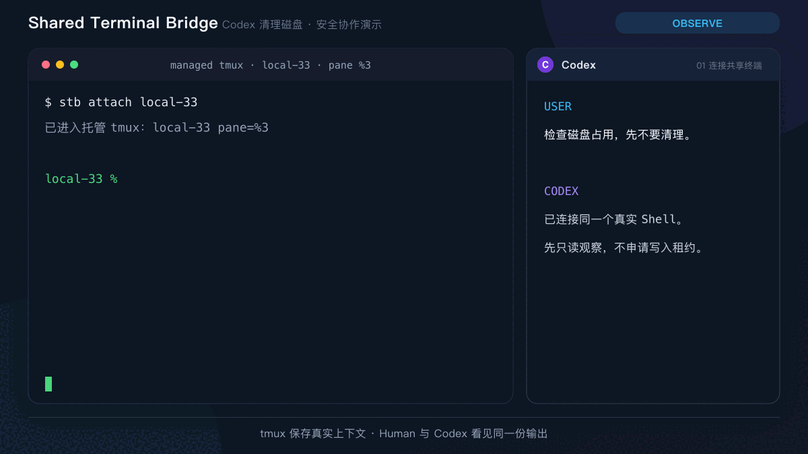
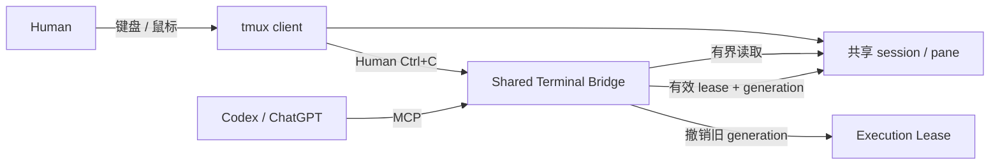

# Shared Terminal Bridge

<p align="center"><a href="https://github.com/sharpbai/shared-terminal-bridge"><strong>STB Core</strong></a> · <a href="https://github.com/sharpbai/shared-terminal-bridge-rdc">RDC Adapter</a> · <a href="https://github.com/sharpbai/shared-terminal-bridge-docs">Documentation</a></p>

让人和 AI 在**同一个真实终端会话**中协作，并把观察、授权、中断和审计变成可控的系统边界。

Shared Terminal Bridge（STB）是一个本地优先的交互式终端桥接层。人继续使用熟悉的 Terminal、tmux 和 SSH；Codex 或其他 MCP 客户端读取同一个 pane，并只在获得授权时向它输入。STB 不创建第二套隐藏 Shell，也不要求目标机器安装 Agent wrapper。



上面的演示以“检查并清理磁盘”为例：AI 先只读观察，给出完整命令；人批准后，命令在共享 pane 中可见执行。长任务由 Bridge 在本地等待并在状态变化时唤醒模型；人随时可以按 `Ctrl+C` 中断命令并撤销当前执行授权。

## 为什么要做 STB

Codex 和 ChatGPT 已经很适合用会话组织开发、研究、方案设计和项目管理。但交互式运维与 IT 支持还有一组不同的问题：

- 操作发生在 SSH、Shell、PowerShell 或交互式程序里，状态持续存在，不能靠每轮复制粘贴重建。
- 人和 AI 需要看到同一份屏幕历史，而不是各自维护一个容易分叉的终端。
- AI 必须能执行命令，但“可以写入”不能等于“此后一直有权写入”。
- 人按下 `Ctrl+C` 通常表示接管或改变意图，不能被模型理解为普通失败后自动重试。
- 已经做出的模型决策可能在等待后过期，旧操作不能越过人的中断继续落到终端。
- 长任务不应靠模型频繁轮询；完整 scrollback、重复状态和 TUI 画面也不应持续消耗上下文。
- 远程能力需要可扩展：今天是本机 tmux 和 SSH，未来可以是远程 PowerShell 或其他操作通道。

STB 的目标，是在“有上下文的 Agent 环境”和“真实操作界面”之间提供一层薄而明确的控制面。

## 它解决什么问题

| 痛点 | STB 的处理方式 |
| --- | --- |
| 人和 AI 使用不同 Shell，状态不一致 | tmux pane 是双方共享的事实来源 |
| 只想查看历史，却被迫申请写权限 | Observation 与 Action 分离，只读无需 lease |
| 人中断后 AI 仍继续旧计划 | `Ctrl+C` 触发 Human Override，立即撤销当前 generation |
| 旧请求或并发任务晚到 | 每次写入都校验 pane、lease 和 generation |
| 长任务靠模型反复询问 | Bridge 本地维护 job/wait，变化时返回有界增量 |
| 终端噪声挤占模型上下文 | Read Delta、AI Context Policy 和 Task Block 控制输入预算 |
| 命令在隐藏脚本中执行 | 命令直接、可见地进入共享 pane，不注入临时脚本 |
| 管理接口绕过终端安全边界 | STB-RDC 模式将目标主机操作收敛到同一 capability plane |

## 工作方式



三个通道彼此独立：

1. **观察通道**：通过 `capture-pane` 和 cursor delta 读取受 ACL 约束的上下文，不要求写入租约。
2. **Agent 输入通道**：通过 Bridge 将可见命令送入 pane；每次操作都校验 execution lease。
3. **Human 控制通道**：tmux client 的真实 `Ctrl+C` 产生 Human Override；Agent 注入的 `C-c` 不会被误判成人工输入。

关键语义是：

```text
Human Ctrl+C ≠ command failed
Human Ctrl+C ≠ automatic retry
Human Ctrl+C = revoke the current Agent execution authority
```

更完整的组件、状态和信任边界见[架构说明](docs/architecture.md)。

## 快速开始

### 1. 准备环境

当前实现需要 Python 3、tmux，以及 macOS 或 Linux 本地 Unix socket 环境。项目本身没有第三方 Python 运行时依赖。

```bash
git clone https://github.com/sharpbai/shared-terminal-bridge.git
cd shared-terminal-bridge
./stb --help
```

如需在任意目录调用，可把仓库的 `bin` 目录加入 `PATH`，或为 `stb` 建立符号链接。

### 2. 创建并进入托管会话

```bash
./stb create disk-check --cwd /path/to/work --enter
```

`stb create` 在默认 socket 不存在时会自动启动 Bridge daemon。托管 session 默认启用鼠标，并为新 pane 配置 100,000 行历史。

如果会话由 MCP 创建，可以在本地一键进入：

```bash
./stb enter disk-check
```

### 3. 日常管理

```bash
./stb list                          # 列出托管会话
./stb info disk-check               # 查看会话、pane 与配置
./stb history disk-check --limit 50 # 查看 tmux/STB 交互历史
./stb jobs                          # 查看受监测的终端任务
./stb approvals                     # 查看长任务批准请求
./stb daemon status                 # 查看本地 Bridge 状态
./stb stop disk-check               # 停止并清理托管会话
```

常用安装方式、daemon 生命周期、人工授权和故障排查见[快速上手](docs/getting-started.md)。完整命令以 `stb --help` 和各子命令的 `--help` 为准。

## 接入 Codex / MCP

STB 的 MCP server 是 Bridge Unix socket 的 stdio 适配层。它不直接操作 tmux，因此 Pane ACL、lease、generation、Human Override 和审计仍由 Bridge 统一强制。

```json
{
  "command": "python3",
  "args": [
    "/absolute/path/shared-terminal-bridge/mcp_server/server.py",
    "--bridge-socket",
    "/tmp/shared-terminal-bridge.sock",
    "--enable-actions",
    "--enable-session-management"
  ]
}
```

默认 MCP 只提供 Observation；只有显式启用 actions 后才注册写入工具。创建会话不等于取得执行权限，模型在首次写入前仍需为当前任务和用户回合取得新的 generation。

详细工具、Codex Turn Identity、长任务批准和取消语义见[最小 MCP Server](docs/mcp-server.md)。

## 安全与协作原则

- **Human first**：人的输入和接管始终高于 Agent 的旧决策。
- **Read by default**：观察与写入分离；读取历史不占用 execution lease。
- **Visible execution**：目标命令直接显示在共享终端中，不注入隐藏脚本、marker 或环境假设。
- **Revocable authority**：授权属于具体 pane 和 generation，可以被人工即时撤销。
- **Fail closed for writes**：未知 pane、失效 lease、旧 generation 和越权能力在写入前被拒绝。
- **Fail open for human control**：Bridge 或日志异常不能阻止真实 `Ctrl+C` 到达前台进程。
- **Bounded context**：只把完成当前判断所需的增量和证据送入模型上下文。
- **Auditable operations**：命令、租约、批准、等待与中断形成可回放的本地记录。

STB 是协作与控制层，不是用户身份认证系统，也不是新的 Web Terminal。当前能力和限制见[路线图](docs/roadmap.md)。

## 文档

- [快速上手与日常管理](docs/getting-started.md)
- [高层架构](docs/architecture.md)
- [托管 tmux Session 与 `stb` 命令](docs/managed-sessions.md)
- [MCP Server 与工具语义](docs/mcp-server.md)
- [API v0.1](docs/api-v0.1.md)
- [AI Context Policy](docs/ai-context-policy.md)
- [验证与回归索引](docs/validation-index.md)
- [演进路线图](docs/roadmap.md)

## 开发与验证

运行自动化测试：

```bash
python3 -m unittest discover -s tests -p 'test_*.py'
```

涉及真实 tmux client 输入的验收需要人工按键，入口和历史验证记录统一收录在[验证与回归索引](docs/validation-index.md)。
